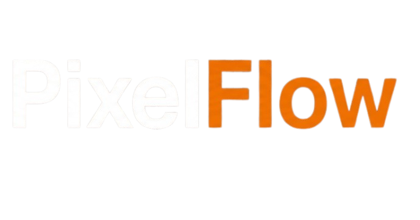

# PixelFlow — Desenvolvimento Web Premium



> Transformamos ideias em soluções digitais modernas, eficientes e que geram resultados reais.

## 📋 Sobre o Projeto

PixelFlow é um projeto integrador desenvolvido por estudantes com o objetivo de simular uma experiência real de mercado, onde uma empresa fictícia foi contratada para criar a presença digital de um cliente.

O projeto foi pensado para representar uma agência moderna de desenvolvimento web, unindo design premium, performance e experiência do usuário em uma landing page totalmente responsiva.

Além da parte visual, o desenvolvimento também teve foco em organização de código, boas práticas de front-end e criação de componentes reutilizáveis.

## 🎯 Objetivo do Projeto

O principal objetivo deste projeto foi aplicar conhecimentos de desenvolvimento web em um cenário próximo ao mercado profissional.

Durante o desenvolvimento, foram trabalhadas habilidades como:

- Estruturação de interfaces modernas
- Responsividade para diferentes dispositivos
- Organização e escalabilidade do código
- Criação de animações e interatividade
- Experiência do usuário (UX/UI)
- Performance e otimização
- Simulação de atendimento e entrega para cliente

## ✨ Features Principais

- 🎨 Design moderno com animações fluidas
- 📱 Interface totalmente responsiva
- ⚡ Performance otimizada
- 🌟 Efeitos visuais premium
- 🧩 Componentes reutilizáveis
- 📊 Dashboard mockup interativo
- 🔍 Estrutura SEO-friendly
- ♿ Boas práticas de acessibilidade

## 🛠️ Tecnologias Utilizadas

### Frontend

- HTML5
- CSS3
- JavaScript Vanilla
- Google Fonts (Poppins)

### Recursos Especiais

- Canvas Particles
- Parallax Background
- Intersection Observer API
- CSS Animations & Transitions
- Glass Morphism

## 📁 Estrutura do Projeto

```bash
pixelflow/
├── index.html
├── style.css
├── img/
│   ├── p.png
│   ├── pixelflow.png
│   ├── fundo.png
│   ├── facebook.png
│   ├── instagram.png
│   ├── linkedin.png
│   ├── github.png
│   └── ...
└── README.md
```

## 🖥️ Seções do Site

### Hero Section

- Efeito parallax
- Background com partículas animadas
- Dashboard mockup
- Call to Actions
- Layout moderno

### Serviços

- Cards interativos
- Hover effects
- Animações suaves

### Sobre

- Informações institucionais
- Estatísticas
- Apresentação da proposta da empresa

### Tecnologias

- Showcase das tecnologias utilizadas
- Estrutura visual moderna

### Projetos

- Simulação de portfólio
- Cards de projetos com categorias

### Contato

- CTA final
- Informações de contato
- Footer completo

## ⚙️ Funcionalidades JavaScript

### Partículas Animadas

Sistema de partículas interativas utilizando Canvas API.

### Scroll Reveal

Animações ao entrar em viewport utilizando Intersection Observer.

### Mobile Menu

Menu responsivo com animações para dispositivos móveis.

### Parallax Effect

Efeito visual suave na seção principal.

## 📱 Responsividade

O projeto foi desenvolvido para funcionar perfeitamente em:

- Desktop
- Tablets
- Smartphones

Breakpoints principais:

- 1024px
- 640px

## 🚀 Aprendizados do Projeto

Este projeto integrador permitiu colocar em prática conceitos fundamentais do desenvolvimento front-end moderno.

Além da parte técnica, também foi uma experiência importante para entender:

- Fluxo de criação de um projeto real
- Organização de interface e experiência do usuário
- Estruturação visual de uma marca
- Importância da performance e responsividade
- Desenvolvimento colaborativo e visão profissional

## 📊 Performance

- HTML, CSS e JavaScript puro
- Estrutura leve
- Carregamento otimizado
- Código organizado e escalável

## 🌐 Compatibilidade

- ✅ Chrome
- ✅ Firefox
- ✅ Edge
- ✅ Safari
- ✅ Navegadores Mobile

## 📄 Licença

Projeto acadêmico desenvolvido para fins educacionais.

## 👨‍💻 Desenvolvimento

Projeto desenvolvido como atividade de Projeto Integrador com foco em:

- Desenvolvimento Front-End
- UI/UX Design
- Responsividade
- Performance
- Estrutura profissional de landing page

---

